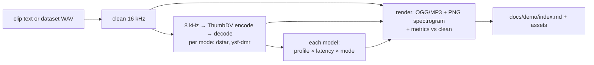

# Demo page

!!! info "Status"
    2026-09-09: planned. As of 2026-09-25 the [Listen](../demo/index.md)
    page is still a placeholder, and the `unamblify demo` script that
    will build it does not exist yet.

The public listening page plays a fixed set of voices as clean audio, after an AMBE-3000 encode and decode cycle, and after processing by each trained model variant. It serves as an objective scorecard for checkpoint performance. The page is generated from a script rather than assembled manually.

## Clips

Clips are generated from two redistributable sources:

- Piper TTS voices (`en_US-libritts_r-medium`, `en_US-ljspeech-high`,
  plus variants for accent and pitch) speaking a fixed script. The
  script includes Harvard sentences, a phonetically dense paragraph,
  a callsign exchange, and a passage with plosives and fricatives.
  Generation is deterministic. The same text, voice, and seed produce
  the same audio. Any differences upon rebuild are due to model changes.
- Dataset clips from held-out speakers (VoiceBank-DEMAND test,
  LibriTTS-R test_clean). Training examples are not used.
  Clips are restricted to corpora marked as redistributable in
  [data sources](../research/data-sources.md#redistribution-is-separate-from-licence).
  Common Voice clips are excluded. CC BY 4.0 attribution is included in the page footer.

Recordings from operators using actual radios may be added later with permission.

## Pipeline (`unamblify demo`)

1. Synthesise or copy the clean clip and normalise it to match the `prepare` pipeline.
2. Process the clip through the chip in all captured modes and retain the channel frames. This uses the dataset capture code path to reflect actual degradation.
3. Run each model from the demo manifest (checkpoint path, profile, latency variant, mode) through the real-time inference path frame by frame.
4. Render the results as compressed audio files and spectrogram PNGs. Calculate metrics (PESQ, STOI, WARP-Q, DNSMOS) against the clean clip.
5. Generate the page with one row per clip and one column per stage. Each cell contains an audio player and a spectrogram. Model cells display the calculated metrics. An A/B toggle allows switching between stages during playback. Model cells also include separate players for the first and last second of audio to evaluate edge effects like cold resets and key-downs.

Assets are stored in `docs/demo/assets/` and tracked in version control. They use Ogg Opus at 32 kbit/s. The published site is self-contained and the version history records changes in audio output for each checkpoint.

## Style

The page uses the site's default dark theme. Spectrograms use a consistent perceptual colour map. The processing stages use identical axes and dynamic range. Difference views (model minus AMBE, model minus clean) use distinct colours to highlight variations.
