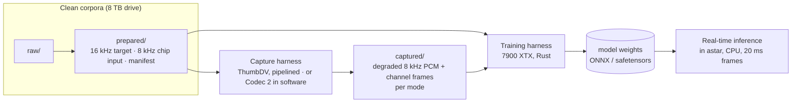

# Design

!!! info "Status"
    2026-09-25: the data and training harnesses and the dashboard are
    built and in daily use (`unamblify prepare | capture | recode |
    augment | shard | train | serve`). Three sticks have captured about
    565 000 AMBE utterances, and both Codec 2 modes are captured in
    software. The [experiment log](../theory/experiment-log.md) has the
    runs. Every run so far trained on Apple Silicon (MPS). The 7900 XTX
    named below is the plan for long runs, not yet the practice. The best
    system is now the restorer + waveform synthesiser
    ([candidate 3](training.md#candidate-3-concretely)), and its Rust
    runtime exists ([pipeline runtime](pipeline-runtime.md), `unamblify
    restore`). The streaming integration into astar is still a plan. Each
    sub-page becomes a spec (`docs/superpowers/specs/`, local) before its
    harness is written, and the decisions that survive come back here.

## The shape of the system

The sub-pages:

| Page | Builds | Runs on |
|---|---|---|
| [Data pipeline](data-pipeline.md) | `prepare` (corpus → aligned 16 kHz/8 kHz clean audio + manifest) and `capture` (clean 8 kHz → ThumbDV, or the `codec2` crate in software → degraded PCM + channel frames, per mode) | the Mac with the DVstick, for weeks (AMBE), or any machine, for hours (Codec 2) |
| [Training](training.md) | dataset sharding, model, losses, evaluation | Linux, AMD 7900 XTX |
| [Real-time](realtime.md) | the streaming post-filter and its astar integration | any CPU astar runs on |
| [Pipeline runtime](pipeline-runtime.md) | the restorer + waveform synthesiser in Rust, batch and frame by frame | any machine that builds the `train` feature |
| [Reproducing from the shared data](reproducing.md) | for a collaborator: train from a shared shard set, restore the chunked chip captures, or start from nothing | anywhere with rclone |
| [Demo page](demo.md) | the listening page, built by a script: clean → AMBE → each model, with spectrograms and metrics | the Mac with the DVstick |

## Decisions already made

**Post-filter on decoded PCM first, bitstream conditioning second.**
Version 1 takes the chip's decoded 8 kHz audio as input. It works with any AMBE
source (hardware decode, AMBEserver, recordings) and avoids the
AMBE+2 decode patent that expires in 2028. Published results in the
[prior art](../research/prior-art.md) use this setting. The capture
harness also stores the channel frames. A future version that uses the 49/72 bits
as side information or replaces the decoder outright will not
require new captures.

**Two vocoder families: AMBE (chip) and Codec 2 (software, for M17).**
The harness captures each `VocoderMode` within a family. AMBE modes use the AMBE-3000 chip because the codec is proprietary and requires hardware encoding. Codec 2 modes (`codec2-3200` for M17 voice and `codec2-1600` for M17 voice and data) run in software using the `codec2` Rust crate. This open codec uses the crate as its reference implementation. Both families share the manifest format, canary discipline, control and status files, `.ambe` channel-frame files, shard format, and loaders. The `.ambe` extension indicates channel frames and the mode specifies the codec. Downstream processing only differs by the per-mode frame word (`frame_samples()` is 160, or 320 for Codec 2 1600). See the [AMBE primer](../research/ambe-primer.md#codec-2-m17) for Codec 2 details.

**Two AMBE vocoders: `dstar` and `ysf-dmr`.** D-STAR (AMBE
2400) and the AMBE+2 2450 half-rate shared by System Fusion DN and DMR
are captured as distinct modes. YSF DN and DMR carry identical 49 voice bits. DMR wraps them in 23 bits of Golay FEC but a chip loopback has no channel errors so the decoded audio is identical. One capture serves both and the mode is named `ysf-dmr`. There is no separate `dmr` capture mode. DMR's FEC only applies under bit errors. The `augment --kind ber` stage handles bit errors using DMR framing synthesized from the 49 bits. The DMR rate word and null frame remain in the code as constants. The retired names `ysf-dn`, `ysf`, and `dmr` parse as `ysf-dmr` and `unamblify migrate-modes` renames older data. System Fusion VW (7200 bit/s) uses a different configuration and requires a verified rate word.

**A generalist model with fine-tuned specialists.**
One shared model is trained on a balanced mix of every vocoder mode using a learned mode embedding to identify the codec. There is one specialist per codec: D-STAR, AMBE+2 (YSF/DMR and NXDN), Codec 2 3200, and Codec 2 1600. Each specialist resumes from the generalist's best checkpoint and trains on its specific mode's shards. Inference uses a single network rather than a chain. A specialist is used only if it provides an audible improvement over the generalist on its specific mode. Initial tests on 2026-09-12 showed the first specialist did not outperform the generalist. The system loads one weights file per connection based on the mode detected by the framing layer (approximately 8 MB for full precision and 2 MB for int8 lite). The lite and super-lite profiles are distilled from the target model for the device.

**Generalist model performance.**
A full-profile ll5 generalist covering all four modes ran 20,000 steps on a balanced shard set (2,778 training examples per mode). It was compared to four single-mode runs on their respective seed shards:

| Mode | Generalist | Single-mode | Difference |
|---|---|---|---|
| YSF/DMR | 10.86 | — | (no single-mode run) |
| Codec 2 3200 | 10.97 | 10.90 | +0.07 |
| D-STAR | 11.06 | 11.02 | +0.04 |
| Codec 2 1600 | 11.22 | 11.09 | +0.13 |

A 2.1 M-parameter model performs within 0.13 LSD of individual models trained per mode using roughly a fifth of the data each. The D-STAR specialist (`configs/specialist-dstar-full-ll5.toml`) started from the generalist's step-20000 checkpoint and ran 6,000 steps at 2e-5 on the `seed-dstar` shards. It converged to 11.06, matching the generalist's D-STAR score. It did not exceed this score at any evaluation step and remained below the from-scratch score of 11.02. The `eval/lsd_rx` metric improved from 14.40 to 14.22.

The current implementation uses a single generalist model. Specialists may be introduced if they demonstrate improved performance. Further testing is required for specialists using expanded D-STAR data, higher fine-tuning learning rates, and smaller profiles like lite or super-lite.

**Model capacity scaling.**
Three model sizes of the same architecture were tested on the `mixed-large` set for 40,000 steps. Results from the best checkpoint for each model are shown below:

| Model | Parameters | Mean LSD | D-STAR | YSF/DMR | C2-3200 | C2-1600 |
|---|---|---|---|---|---|---|
| lite | 315 K | 11.15 | 11.33 | 11.12 | 11.03 | 11.12 |
| full ×1 | 2.1 M | 10.89 | 11.08 | 10.74 | 10.80 | 10.90 |
| full ×1.75 | 6.4 M | 10.85 | 11.02 | 10.73 | 10.74 | 10.89 |

Increasing the parameter count by a factor of three improves the mean LSD by 0.04 and individual modes by a maximum of 0.06. Reducing the parameter count to one-seventh decreases performance by 0.26. The performance curve flattens above the full profile size. Increasing the training set from 11k to 142k examples improved the mean LSD by 0.20 and Codec 2 1600 by 0.32, indicating data scaling is more effective than model size scaling.

The `unamblify bench` tool shows the 6.4 M model uses 0.8% of the 20 ms budget on an M-series core. While computationally feasible, larger models offer minimal performance gains and require 24 MB of weights compared to 8 MB for the full profile.

The task likely has a performance ceiling for this filter architecture. AMBE discards phase information and frequencies above 3.7 kHz, requiring models to infer missing details. Tested configurations score between 10.7 and 11.4. The filter family reached a maximum predicted MOS of 2.1. The restorer and waveform synthesizer ([candidate 3](training.md#candidate-3-concretely)) provided further improvements.

The experimental setup is configurable. Runs specify modes in the configuration (`[data] mode = "dstar"` for single modes or `[data] modes = ["dstar", "codec2-3200"]` for shared models). Shard sets can include multiple modes balanced per split (`unamblify shard --modes …`), with each example labeled by mode. The `[model] mode_embed = true` setting enables per-mode embedding. Evaluation reports metrics per mode alongside the mean, allowing comparison across single-vocoder, blind shared, and conditioned shared models on the same datasets. See [training](training.md#inputs-and-targets).

**Three inference profiles.** The architecture supports three profiles: *full* for standard CPUs (Apple Silicon, EPYC/Xeon, desktop AMD/Intel) with 16 kHz output, *lite* for mobile ARM processors with limited memory bandwidth using 8 kHz int8 output distilled from the full model, and *super lite* for microcontrollers (ESP32/STM32/RP2350-class) with under 100K parameters and `no_std` compatibility distilled from the lite model. The runtime selects the largest profile that completes within 25% of the frame period. Profiles may be adjusted based on performance metrics. See [real-time](realtime.md#profiles).

**Two latency variants.** The models include *ll5* (5 AMBE frames, 100 ms) for conversational latency and *ll20* (20 frames, 400 ms) for maximum quality. Lookahead is configured during training. See [real-time](realtime.md#latency-variants).

**Sampling rates.** The models process 8 kHz input and produce 16 kHz output. Both natural narrowband and bandwidth extension goals use the same model architecture with an upsampling head. The 16 kHz output is compatible with the playback resampling path. The candidate 3 pipeline outputs 24 kHz audio, which uses the same resampling process.

**Rust implementation.** The training and inference pipelines are written in Rust. Training supports Apple Silicon, AMD ROCm, and CUDA backends through Cargo features using `tch-rs` and libtorch. A parallel implementation using `burn` is in development for smaller models. Inference uses pure Rust without libtorch, relying on `ort` or `tract` for ONNX graphs, or custom kernels for smaller models. See [training](training.md).

**Dataset splitting.** The datasets use speaker-disjoint splits with VoiceBank-DEMAND test speakers held out to prevent speaker leakage and maintain comparability with published PESQ/STOI metrics.

## Open questions

- Does decode pipeline as well as encode on the AMBE-3000? (Determines
  whether capture takes three weeks or two months.)
- What is the exact sample offset between chip input and decoded output,
  and is it constant? (Determines whether losses need to be shift-tolerant.)
- How much input-side "ham mic" augmentation helps versus hurts
  intelligibility on real QSOs.
- Whether a mode-conditioned shared model beats two separate ones (the
  harness runs all three arms, and the numbers are not in yet).
- Whether bit errors need to arrive in bursts, and therefore whether
  YSF's on-air placement has to be modelled. Six contiguous bits
  exhaust mode 1's Golay word and lose the frame. At a 2 % independent
  error rate only 0.12 % of frames are lost. (Determines whether
  `augment --kind ber` needs a burst generator and the `aabc`
  placement map, which is test-only in `channel` today.)
