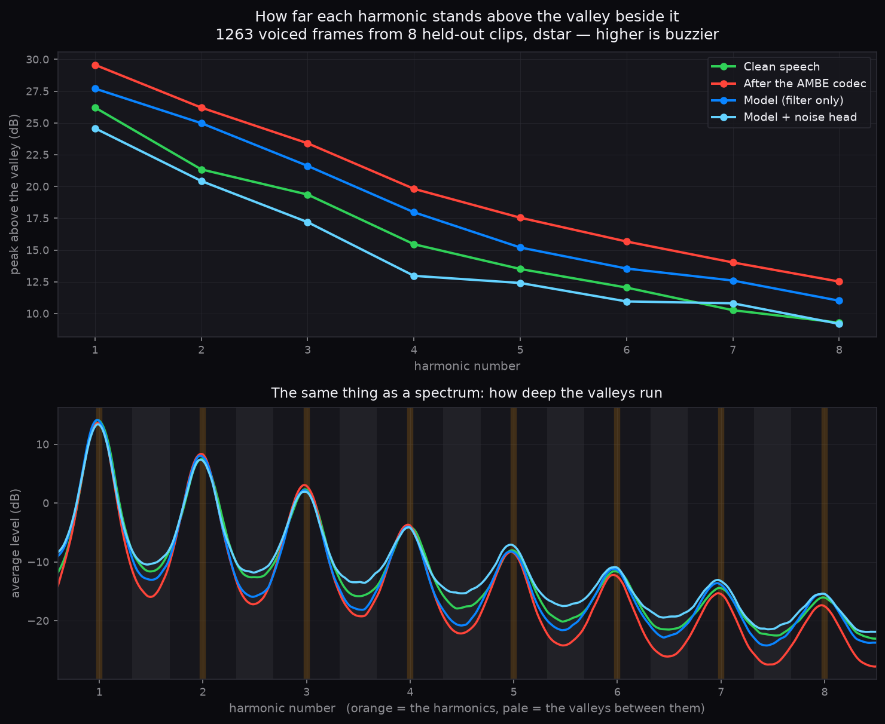

# What the codec destroys

!!! info "Provenance"
    Written 2026-09-12. The bit-level detail and its sources are in the
    [AMBE primer](../research/ambe-primer.md). This page is the
    perceptual reading of those same facts: which loss causes which
    artefact, and which of them a post-filter can do anything about.

## Compression ratios

Telephone-quality PCM is 128 kbit/s. A D-STAR voice channel provides the vocoder with 2 400 bit/s. This ratio of roughly 53:1 is beyond the limit of waveform coding, which would leave about half a bit per sample.

AMBE therefore codes a model of the waveform rather than the waveform itself, and re-synthesizes speech at the receiver. The implications for unamblify stem from this design.

## What one frame keeps

Every 20 ms, the Multi-Band Excitation model transmits roughly this:

| Parameter | What it is | Bits (D-STAR) |
|---|---|---|
| Fundamental ω₀ | the pitch, 50–400 Hz | 7 |
| Voiced/unvoiced flags | is each ~500 Hz band buzz or hiss? | 8 |
| Spectral magnitudes | the envelope, sampled once per harmonic | 57 |

The decoder uses these parameters to synthesize speech. Voiced bands are rendered as sinusoids at multiples of the fundamental frequency, while unvoiced bands are rendered as filtered noise. Both are scaled to the transmitted envelope. The result is intelligible speech, but it contains artifacts due to four main limitations.

## The four structural losses

### 1. Phase is not transmitted

Phase information is not transmitted. The decoder estimates phase by advancing each harmonic smoothly between frames. This maintains the magnitude spectrum but alters the time-domain waveform.

While the human ear is relatively insensitive to absolute phase in steady tones, phase alignment is important during transients. Plosives and the sharp edges of consonants require phase alignment across multiple harmonics. Synthesized phase disrupts this alignment, which often results in a smeared or "underwater" sound quality.

### 2. Frequencies above 3.7 kHz are discarded

Magnitudes are only transmitted for frequencies below approximately 3.7 kHz. High-frequency sibilants, which help distinguish sounds like *s*, *f*, and *th*, are lost and rendered as generic noise. A post-filter cannot recover this missing data. However, it can synthesize high-frequency content by leveraging the correlation between the lower spectrum and typical high-frequency shapes. This process relies on bandwidth extension techniques to generate plausible replacements rather than recovering original data.

### 3. The strict harmonic model

Natural voiced speech is not perfectly periodic; it contains variations like jitter, shimmer, breath noise, and varying glottal pulse shapes. The MBE model strictly categorizes bands as either fully periodic or fully noise. The intermediate characteristics, such as breath noise between harmonics, are lost. This can make the voice sound synthetic. Additionally, binary voiced/unvoiced decisions can fluctuate on marginal sounds, producing metallic artifacts.

This limitation is partially recoverable. The missing inter-harmonic structure is often predictable from the context. Using the envelope, pitch, and recent temporal context, a model can estimate and reintroduce a realistic fine structure.

### 4. Parameter quantization and frame rate

With seven bits allocated for pitch between 50 and 400 Hz, the pitch contour exhibits discrete steps. The 57 bits used for the envelope provide limited resolution. These parameters are updated every 20 ms, meaning rapid transitions align to this grid. This quantization leads to staircased formant transitions, contributing to a mechanical or buzzy quality. This artifact can often be mitigated by applying smoothing filters conditioned on adjacent frames.

## Post-filter capabilities

The extent to which a post-filter can address these limitations varies:

| Loss | Mitigation | Method |
|---|---|---|
| Inter-harmonic fine structure | High | Predicted from the envelope and temporal context. |
| Parameter quantization | High | Temporal smoothing across frames. |
| High-frequency loss (3.7–8 kHz) | Medium | Synthesized based on correlation with the low-frequency spectrum. |
| Transient phase | Low | Onsets can be sharpened but original alignment is lost. |

The original bitstream is permanently lost. Post-filtering relies on the redundancy of human speech. While many signals could produce a given sequence of AMBE frames, only a subset represents plausible human speech. A neural network acts as a learned prior over this subset.

## Measuring post-filter effectiveness

The following measurements are based on evaluation clips dated 2026-09-13. The metric compares harmonic-peak energy to inter-harmonic trough energy on voiced frames below 4 kHz. A higher value indicates a more strictly periodic signal, which correlates with mechanical artifacts:

| Signal | D-STAR | Excess over clean (mean) | Per-frame \|excess\| |
|---|---|---|---|
| Clean speech | 9.7 dB | — | — |
| After the codec | 13.1 dB | +3.4 | 4.1 |
| After the filter-only model | 11.3 dB | +1.5 | 3.0 |
| With the noise head and `hnr_w` | 8.9 dB | −0.9 | 2.6 |

Both signals are evaluated on frames classified as voiced in the clean reference to ensure consistent comparison ([details](../metrics/hnr.md)).

In natural speech, there is typically a 10 dB difference between harmonics and the intervening troughs, which contain broadband noise components like breath and jitter. The AMBE codec attenuates these troughs, resulting in an output that is 3.4 dB more periodic than the source on average. A filter-only model reduces this excess to +1.5 dB, leaving some residual robotic qualities. Introducing a noise head brings the mean excess closer to the baseline.

!!! warning "A mean of zero was not a match"
    While the mean excess crosses zero, per-frame measurements show a spread from −5 dB to +3 dB (p10–p90). The per-frame absolute error of 2.6 dB remained largely unchanged during training. The model tends to add a constant level of noise rather than adapting to the target's specific breathiness profile. This resulted in over-filling the 0–1 kHz band by 1.1 dB while leaving the 2–4 kHz band largely untouched. This was addressed by modifying the loss function and metric to weight every harmonic equally, rather than letting the loudest harmonics dominate the ratio. The noise path is now modulated by the periodic envelope to better simulate breath noise. The [MOS predictor](../metrics/mos.md) estimates this model at 2.2, compared to the original recording's 4.05.

The top panel details this measurement across voiced frames and harmonics. It illustrates the height of each harmonic peak relative to the adjacent trough. The codec (red) exhibits deeper valleys than the clean reference (green). The filter-only model (blue) partially mitigates this, while the model with a noise head (cyan) approximates the clean reference level more closely.

The bottom panel displays the log-domain average spectrum over 1,263 voiced frames. The depth of the spectral dips between harmonic peaks is most pronounced in the codec output and shallowest in the noise-head model.

!!! note "Common evaluation frames"
    Measurements across signals use identical frames - specifically, those identified as voiced in the clean reference. Allowing each signal to determine its own voicing classification would artificially inflate differences, as more periodic signals pass the voicing threshold more frequently.

Two factors contributed to the persistent mechanical artifacts:

1. **Filters cannot synthesize missing energy.** Applying FIR and comb filters to a periodic signal maintains its periodicity without adding energy to the empty troughs. Comb filters tend to sharpen harmonics further. This is addressed by the `[model] noise_head` path, which introduces shaped aperiodic excitation scaled to the local signal level. This allows energy to be added where the input spectrum is empty.
2. **Loss function constraints.** Standard spectral loss compares output magnitudes against a specific clean recording. Because breath noise is stochastic, a model cannot reconstruct the exact noise realization. To minimize error, models default to a smooth, deterministic output. Implementing `[train] hnr_w` addresses this by comparing the harmonic-to-trough ratio (in dB) on voiced frames, penalizing excessive periodicity and encouraging the generation of appropriate noise.

    A prior approach using a cepstral statistic proved ineffective, as the model minimized the metric by introducing ripple at adjacent quefrencies without filling the troughs.

The `eval/hnr` metric tracks this property in dB. A value of zero indicates periodicity matching the reference, while positive values indicate excess periodicity. The filter-only model scores approximately +1.5, and the noise-head model scores −0.9. The `eval/hnr_abs` metric provides the per-frame absolute error.

## Evaluating stop consonants

The 20 ms update rate also degrades plosives. Sounds like 'p', 't', or 'k' consist of a brief silence followed by a short burst. An unvoiced frame with a single envelope cannot encode the exact timing of this burst within the 20 ms window. Measurements from 73 bursts in the D-STAR evaluation clips illustrate this effect:

| Signal | Burst peak | Closure depth | Rise time | Burst length |
|---|---|---|---|---|
| Clean | 0 | 43.5 dB | 2.9 ms | 10 ms |
| After the codec | −12.8 dB | 31.7 dB | 13.7 ms | 30 ms |
| After the noise-head model | −13.3 dB | 28.0 dB | 14.0 ms | 29 ms |

The codec extends the burst duration threefold, reduces its peak amplitude, and slows the rise time. Early models did not address this smearing, and the noise-head model reduced the closure depth by an additional 3 dB. Because per-frame gains were held for 10 ms and the shortest loss window was 32 ms, short bursts were not adequately resolved. The introduction of a [transient term](../metrics/loss-terms.md), 1 ms gains in the noise path, and [`eval/plosive_*`](../metrics/plosive.md) metrics are designed to improve this. Plosive timing is partially recoverable, as the burst position is constrained by the subsequent vowel onset visible in the lookahead buffer.

This limitation mirrors findings in other low-bitrate codecs, such as the transition from LACE to NoLACE, which similarly incorporated generative paths to supplement filtering.

## Performance limitations

This framework establishes theoretical limits, which align with [experimental results](what-the-experiments-showed.md). The model's accuracy is constrained by the information present in the decoded frames. Expanding the model architecture or increasing parameter counts does not introduce new constraints; only additional training data provides further priors. Consequently, various filter configurations consistently perform within a narrow range, typically around 2.1 predicted MOS.

The restorer and waveform synthesizer pipeline (candidate 3 in [training](../design/training.md)) overcomes this limitation by regenerating the waveform rather than filtering the decoder output. This approach achieves a 3.57 predicted MOS on reference inputs, compared to 2.22 for the standard codec and 4.14 for clean speech. In a blind listening test, it scored 4.6 out of 5.

## Applicability to Codec 2

The M17 protocol utilizes [Codec 2](../research/ambe-primer.md#codec-2-m17) at bitrates of 3,200 or 1,600 bit/s. While Codec 2 employs a different parameter set and extends frames to 40 ms at the lower bitrate, it is also a harmonic sinusoidal coder. The four categories of information loss apply similarly. A single model with a [mode embedding](the-post-filter.md#mode-embedding) can address artifacts from both codecs by adjusting its priors based on the specific codec characteristics.
